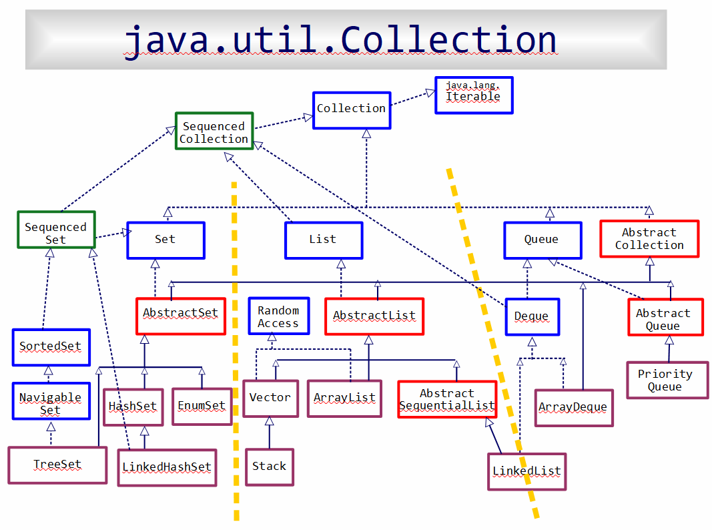
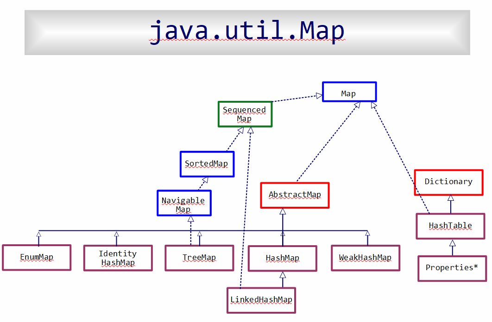

# JavaCollections-ref

Java collections is two "klan"s -- rooted at `java.util.Collection` and at `java.util.Map`. 

This repository provides a quick ref to these two hierarchies. 

The two image files (see below) show each of these hierarchies in full. 
[Java Collections.pdf](https://github.com/ayseA/JavaCollections-lookup/blob/main/Java%20Collections.pdf) provides some/more details. 

These are documented at the time of Java 22. So they also include the 3 new interfaces introduced into Java Collections in Java 21 -- `SequencedCollection`, `SequencedSet` and `SequencedMap`.

 

#

 

